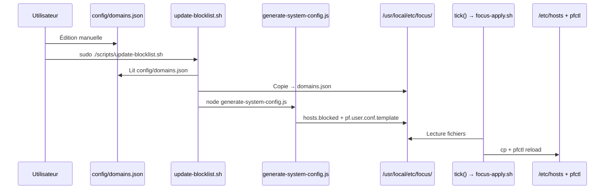
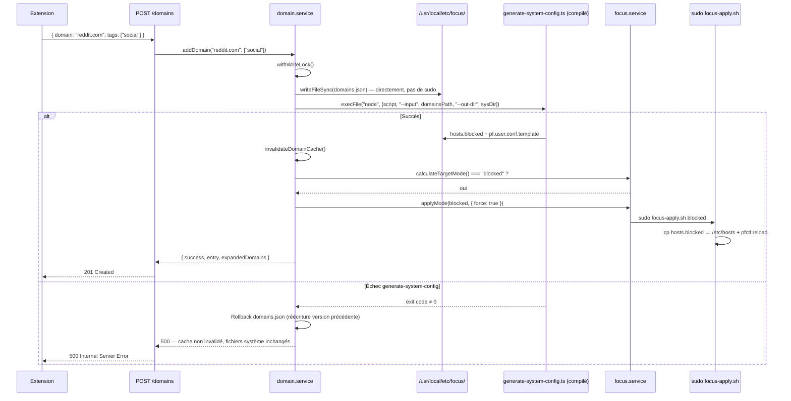

# Dynamic Domain Management — Technical Spec

## 1. Requirement Summary

- **Problem** : L'ajout de domaines à la blocklist nécessite actuellement un accès terminal + `sudo update-blocklist.sh`. L'extension Chrome est en lecture seule — aucune visibilité sur les domaines bloqués ni possibilité d'en ajouter.
- **Goals** :
  1. Ajouter/supprimer des domaines depuis le popup de l'extension Chrome
  2. Afficher la liste des domaines bloqués dans l'extension
  3. Permettre l'ajout rapide du domaine de l'onglet actif (un clic)
  4. Appliquer automatiquement les modifications sans intervention manuelle (pas de `sudo`, pas de terminal)
- **Scope** : `packages/shared` (types), `apps/server` (API + service + migration script TS), `apps/extension` (UI).

## 2. Existing Code Analysis

### Pipeline actuelle



### Fichiers impactés

| Fichier                                             | Rôle actuel                                          | Impact                                                                                                                 |
| --------------------------------------------------- | ---------------------------------------------------- | ---------------------------------------------------------------------------------------------------------------------- |
| `packages/shared/src/api.ts`                        | Types `DomainsResponse`                              | Ajouter `AddDomainRequest`, `AddDomainResponse`, `DomainEntryResponse`                                                 |
| `apps/server/src/utils/hostname.ts`                 | _(nouveau)_                                          | Extraire `normalizeHostname()` — source unique partagée (service + script)                                             |
| `apps/server/src/scripts/generate-system-config.ts` | _(migration de `scripts/generate-system-config.js`)_ | Réécrit en TS, importe `normalizeHostname` depuis `../utils/hostname`                                                  |
| `apps/server/scripts/generate-system-config.js`     | Génère hosts.blocked + pf template                   | **Supprimé** — remplacé par le TS compilé dans `dist/scripts/`                                                         |
| `apps/server/src/services/domain.service.ts`        | `getExpandedDomains()` (cache one-shot)              | Ajouter CRUD + invalidation cache + régénération directe                                                               |
| `apps/server/src/services/focus.service.ts`         | `tick()` + `applyMode()`                             | Exporter + ajouter paramètre `force` à `applyMode()` + exporter `calculateTargetMode()` (les deux actuellement privés) |
| `apps/server/src/controllers/focus.controller.ts`   | `getStatus`, `getDomains`                            | Ajouter `addDomain`, `removeDomain`, `getDomainEntries`                                                                |
| `apps/server/src/routes/focus.routes.ts`            | GET `/status`, GET `/domains`                        | Ajouter POST `/domains`, DELETE `/domains/:domain`, GET `/domains/entries`                                             |
| `apps/server/src/app.ts`                            | CORS GET-only                                        | Autoriser POST + DELETE                                                                                                |
| `apps/server/scripts/install.sh`                    | Installe focus-apply.sh dans sudoers                 | Réordonner (build avant config gen) + `chown $REAL_USER` sur `/usr/local/etc/focus/`                                   |
| `apps/server/scripts/update-blocklist.sh`           | Met à jour la blocklist installée                    | Pointer vers `dist/scripts/generate-system-config.js`                                                                  |
| `apps/extension/src/background.ts`                  | Polling + blocking rules                             | Ajouter handler `DOMAINS_UPDATED`                                                                                      |
| `apps/extension/src/index.ts`                       | Popup read-only, `fetchWithTimeout(url: string)`     | Nouveau UI + signature étendue `fetchWithTimeout(url, init?: RequestInit)` pour POST/DELETE                            |
| `apps/extension/index.html`                         | Popup 260px minimal                                  | Nouvelles sections UI                                                                                                  |

### Contraintes identifiées

| Contrainte                  | Description                                                                                                                                                                                             |
| --------------------------- | ------------------------------------------------------------------------------------------------------------------------------------------------------------------------------------------------------- |
| **Serveur = user-level**    | Le serveur tourne via LaunchAgent (user), PAS root. L'install configure les permissions pour que `/usr/local/etc/focus/` soit writable par l'utilisateur.                                               |
| **Sudo = apply uniquement** | Seul `focus-apply.sh` nécessite sudo (écrit `/etc/hosts` + reload PF). La gestion des domaines ne nécessite aucun sudo.                                                                                 |
| **Source unique hostname**  | `normalizeHostname()` existe en un seul endroit (`src/utils/hostname.ts`). Le script de génération (migré en TS) l'importe directement — zéro dérive.                                                   |
| **Source de vérité unique** | `/usr/local/etc/focus/domains.json` est la source runtime (prod). Le fichier repo `config/domains.json` est le seed initial (install.sh) et le fallback en dev (quand `DOMAINS_PATH` n'est pas défini). |
| Cache `domain.service.ts`   | Variable `cachedDomains` chargée une seule fois — doit supporter l'invalidation.                                                                                                                        |
| CORS                        | Actuellement `methods: ['GET']` — doit autoriser POST/DELETE.                                                                                                                                           |
| Extension MV3               | Le popup peut appeler `chrome.tabs.query()` directement (permission `tabs` déjà accordée). `activeTab` est redondant — ne pas l'ajouter.                                                                |
| Extension ≠ api-client      | L'extension utilise `fetchWithTimeout()` direct, pas `@focus/api-client`. Garder cette approche pour V1 (cohérence avec le code existant).                                                              |

## 3. Technical Solution

### 3.1 Nouveaux types partagés (`packages/shared/src/api.ts`)

```typescript
// POST focus/domains — Ajouter un domaine
export type AddDomainRequest = {
  domain: string;
  tags?: string[];
};

export type AddDomainResponse = {
  success: boolean;
  entry: DomainEntryResponse;
  expandedDomains: string[];
};

// DELETE focus/domains/:domain — Supprimer un domaine
export type RemoveDomainResponse = {
  success: boolean;
  expandedDomains: string[];
};

// GET focus/domains/entries — Entrées brutes (non expansées)
export type DomainEntryResponse = {
  domain: string;
  tags: string[];
};

export type DomainEntriesResponse = {
  entries: DomainEntryResponse[];
};
```

### 3.2 Utilitaire partagé — `normalizeHostname()` (`apps/server/src/utils/hostname.ts`)

Extraire la logique existante de `generate-system-config.js` (lignes 42-67) dans un module TypeScript. **Signature identique au JS d'origine**, y compris la gestion de `null`/`undefined` :

```typescript
/**
 * Normalise et valide un hostname.
 * Accepte : hostname brut, URL complète, null, undefined.
 * Retourne null si invalide.
 *
 * Source unique — importée par domain.service.ts ET generate-system-config.ts.
 */
export function normalizeHostname(input: string | null | undefined): string | null {
  const raw = String(input ?? '')
    .trim()
    .toLowerCase();
  if (!raw) return null;

  // Extraction hostname depuis URL
  let host = raw;
  try {
    if (raw.includes('://')) host = new URL(raw).hostname;
  } catch {
    /* ignore */
  }

  // Supprimer path/query/fragment
  host = host.split('/')[0].split('?')[0].split('#')[0];

  // Trailing dot
  if (host.endsWith('.')) host = host.slice(0, -1);

  // Validation
  if (!/^[a-z0-9.-]+$/.test(host)) return null;
  if (!host.includes('.')) return null;
  if (host.startsWith('.') || host.endsWith('.')) return null;
  if (host.includes('..')) return null;

  return host;
}
```

### 3.3 Migration `generate-system-config.js` → TypeScript

**Motivation** : Le script JS contient sa propre copie de `normalizeHostname()` + une logique de groupement/rendu complexe (~225 lignes). La migration vers TS permet :

- **Zéro dérive** : `normalizeHostname` importé depuis `../utils/hostname`
- **Type safety** : interfaces typées pour `DomainsJson`, `DomainJsonEntry`, `GroupedDomains`
- **Un seul build** : compilé avec le reste du serveur (`tsc` → `dist/scripts/generate-system-config.js`)

**Nouveau fichier** : `apps/server/src/scripts/generate-system-config.ts`

```typescript
import { normalizeHostname } from '../utils/hostname';
import fs from 'fs';
import path from 'path';

// --- Types internes ---

interface DomainJsonEntry {
  domain: string;
  aliases?: string[];
  tags?: string[];
  includeWww?: boolean;
  includeMobile?: boolean;
  hosts?: boolean;
  pf?: boolean;
}

interface DomainsJson {
  version: number;
  defaults: {
    includeWww?: boolean;
    includeMobile?: boolean;
    hosts?: boolean;
    pf?: boolean;
  };
  entries: DomainJsonEntry[];
}

// --- Logique conservée (portée depuis le JS) ---
// parseArgs(), uniqueStable(), buildHostnamesForEntry(),
// groupEntries(), renderHostsBlocked(), renderPfTemplate()
// → Même logique, normalizeHostname() importé au lieu de dupliqué.

function main(): void {
  const args = parseArgs(process.argv);
  const input = args.input || path.join(process.cwd(), 'config', 'domains.json');
  const outDir = args['out-dir'] || null;

  if (!outDir) {
    console.error('Missing --out-dir');
    process.exit(2);
  }

  const raw = fs.readFileSync(input, 'utf8');
  const domainsJson: DomainsJson = JSON.parse(raw);
  if (domainsJson.version !== 1) {
    throw new Error(`Unsupported domains.json version: ${domainsJson.version}`);
  }

  const groups = groupEntries(domainsJson);
  fs.mkdirSync(outDir, { recursive: true });
  fs.writeFileSync(path.join(outDir, 'hosts.blocked'), renderHostsBlocked(groups), 'utf8');
  fs.writeFileSync(path.join(outDir, 'pf.user.conf.template'), renderPfTemplate(groups), 'utf8');
}

main();
```

**Interface CLI inchangée** : `node dist/scripts/generate-system-config.js --input <path> --out-dir <path> [--print]`

**Ancien fichier `scripts/generate-system-config.js`** : supprimé après migration.

### 3.4 Server — `focus.service.ts` : paramètre `force` sur `applyMode()`

**Problème résolu** : `tick()` est un no-op quand `targetMode === currentMode`. Après ajout d'un domaine en mode `blocked`, les fichiers système sont régénérés mais jamais appliqués (pas de `cp` vers `/etc/hosts`, pas de `pfctl reload`) jusqu'au prochain changement de mode.

**Solution** : ajouter un paramètre `force` à `applyMode()` existant plutôt qu'une fonction séparée. Cela centralise le guard + apply + error handling en un seul point de maintenance :

```typescript
/**
 * Applique le mode cible. Si force=true, contourne le guard
 * targetMode === currentMode — utilisé après modification de la
 * liste de domaines (les fichiers système ont changé).
 */
export async function applyMode(
  targetMode: ApplicableFocusMode,
  { force = false, reason }: { force?: boolean; reason?: string } = {},
): Promise<void> {
  if (!force && targetMode === currentMode) return;

  if (isApplying) {
    log.warn({ targetMode, force }, 'applyMode skipped — already applying');
    return;
  }

  isApplying = true;
  log.info({ mode: targetMode, force, reason }, 'Applying mode');

  try {
    await apply(targetMode);
    currentMode = targetMode;
    log.info({ mode: targetMode }, 'Apply completed');
  } catch (error) {
    // Non-fatal : le domaine est persisté dans domains.json et sera
    // appliqué au prochain tick() (≤ 60s). Ce comportement est
    // cohérent avec le contrat existant de applyMode().
    const e = error as Error;
    log.error({ err: e }, 'Apply failed');
  } finally {
    isApplying = false;
  }
}
```

Usage dans `domain.service.ts` après modification de domaines :

```typescript
const target = calculateTargetMode();
if (target === 'blocked') {
  await applyMode(target, { force: true, reason: 'domain list changed' });
}
```

### 3.5 Server — `domain.service.ts` refactoring

```typescript
import { normalizeHostname } from '../utils/hostname';
import { applyMode, calculateTargetMode } from './focus.service';
import { execFile } from 'child_process';
import { promisify } from 'util';
import fs from 'fs';
import path from 'path';

const execFileAsync = promisify(execFile);

/**
 * Chemin runtime des domaines. Fallback sur le fichier repo en dev.
 *
 * ⚠ En dev (DOMAINS_PATH non défini), le fallback pointe vers config/domains.json
 * dans le repo. Les ajouts/suppressions via l'API modifient directement ce fichier.
 * Pour éviter de modifier le seed, définir DOMAINS_PATH dans .env.
 */
const DOMAINS_PATH = process.env.DOMAINS_PATH || path.resolve(__dirname, '../../config/domains.json');

/** Script compilé de régénération (depuis dist/). */
const GEN_SCRIPT_PATH = path.resolve(__dirname, '../scripts/generate-system-config.js');

/** Répertoire de sortie pour les fichiers système générés. */
const SYSTEM_DIR = path.dirname(DOMAINS_PATH);

/**
 * Deux niveaux de cache :
 * - cachedConfig: DomainsConfig | null — config brute (pour getDomainEntries)
 * - cachedDomains: string[] | null — domaines expansés (pour getExpandedDomains)
 *
 * Lazy-init : chaque cache est peuplé à la première lecture, puis invalidé
 * après chaque écriture (addDomain / removeDomain).
 *
 * Note : DomainsConfig est le type existant dans domain.service.ts (≠ DomainsJson
 * défini dans generate-system-config.ts qui inclut les champs hosts/pf).
 */
let cachedConfig: DomainsConfig | null = null;
let cachedDomains: string[] | null = null;

function loadConfig(): DomainsConfig {
  if (!cachedConfig) {
    const raw = fs.readFileSync(DOMAINS_PATH, 'utf8');
    cachedConfig = JSON.parse(raw) as DomainsConfig;
  }
  return cachedConfig;
}

/** Invalide les deux caches — force une relecture au prochain appel. */
export function invalidateDomainCache(): void {
  cachedConfig = null;
  cachedDomains = null;
}

/** Retourne les entrées brutes (non expansées) depuis le cache. */
export function getDomainEntries(): DomainEntryResponse[] {
  const config = loadConfig();
  return config.entries.map((e) => ({
    domain: e.domain,
    tags: e.tags ?? [],
  }));
}

/**
 * Ajoute un domaine.
 * 1. Valide via normalizeHostname()
 * 2. Vérifie qu'il n'existe pas déjà (409)
 * 3. Écrit le JSON modifié dans DOMAINS_PATH
 * 4. Régénère hosts.blocked + pf.user.conf.template via le script TS compilé
 * 5. Invalide le cache mémoire
 * 6. Si mode courant = blocked → applyMode(target, { force: true }) (ré-applique avec les nouveaux fichiers)
 */
export async function addDomain(domain: string, tags?: string[]): Promise<DomainEntryResponse>;

/**
 * Supprime un domaine.
 * Même pipeline que addDomain (write → regenerate → invalidate → applyMode force).
 */
export async function removeDomain(domain: string): Promise<void>;
```

**Différences clés avec la version précédente du spec** :

| Changement                     | Avant                                                 | Après                                                                                      |
| ------------------------------ | ----------------------------------------------------- | ------------------------------------------------------------------------------------------ |
| Application après modification | `tick()` (no-op si déjà blocked)                      | `applyMode(target, { force: true })` (contourne le guard)                                  |
| Script de régénération         | `../../scripts/generate-system-config.js` (JS séparé) | `../scripts/generate-system-config.js` (TS compilé, même build)                            |
| `getDomainEntries()`           | Sync `readFileSync` (stale data possible)             | Lecture depuis le cache mémoire (toujours cohérent après invalidation)                     |
| `SYSTEM_DIR` couplage          | Implicite                                             | Documenté : suit `DOMAINS_PATH`, si l'env var change, le répertoire de sortie change aussi |

**Type `DomainEntry` — modification** : ajouter `tags?: string[]` au type existant (`domain.service.ts:7-12`) :

```diff
 export type DomainEntry = {
   domain: string;
   aliases?: string[];
   includeWww?: boolean;
   includeMobile?: boolean;
+  tags?: string[];
 };
```

> **Limitation V1** : `domains.json` contient aussi les champs `hosts?: boolean` et `pf?: boolean` par entrée (utilisés par `generate-system-config` pour le filtrage hosts/pf, cf. `DomainJsonEntry` §3.3). Ces champs ne sont **pas** ajoutés à `DomainEntry` côté serveur — ils ne sont ni exposés via l'API ni pris en compte par `expandDomainEntries()`. Les domaines ajoutés via l'extension utilisent les `defaults`. Ce décalage est intentionnel : `DomainEntry` reste le type API, `DomainJsonEntry` reste le type interne au script de génération.

### 3.6 Pipeline de régénération



**Détail** :

1. `domain.service.ts` lit `/usr/local/etc/focus/domains.json`, modifie en mémoire, écrit directement (le répertoire appartient à l'utilisateur)
2. Appelle `node dist/scripts/generate-system-config.js --input <path> --out-dir <dir>` — pas de sudo, le serveur a les droits d'écriture
3. `invalidateDomainCache()` force la relecture au prochain `getExpandedDomains()`
4. Si le mode courant est `blocked`, appelle `applyMode(target, { force: true })` qui exécute `sudo focus-apply.sh blocked` pour copier les nouveaux fichiers et recharger PF

**Pourquoi `applyMode(force: true)` et pas `tick()` ?** `tick()` calcule `targetMode` et compare avec `currentMode` — si les deux sont `blocked`, c'est un no-op. `applyMode` avec `force: true` contourne ce guard : le mode n'a pas changé, mais le contenu des fichiers oui.

> **Note** : si `applyMode(force: true)` échoue (ex. `focus-apply.sh` timeout), l'API retourne tout de même **201 Created**. Le domaine est persisté dans `domains.json` et les fichiers système sont régénérés — l'application effective (copie `/etc/hosts` + PF reload) se fera au prochain `tick()` (≤ 60s). Ce comportement est cohérent avec le contrat existant de `applyMode()`.

### 3.7 Mise à jour scripts shell

#### `install.sh` — Réordonner build avant config generation

Le script de génération étant désormais compilé (`dist/scripts/`), le build doit précéder la génération des configs système.

**Résolution du fichier seed** : Le repo contient `config/domains.example.json` (template public, commit `afb4ebb`). L'utilisateur doit créer `config/domains.json` à partir de l'exemple avant d'exécuter `install.sh`. Le script vérifie l'existence du fichier et affiche un message d'erreur explicite si absent.

```bash
# AVANT: 1.Config → 2.Script → 3.PF → 4.Sudoers → 5.Build
# APRÈS: 1.Preflight → 2.Build → 3.Config → 4.Script → 5.PF → 6.Sudoers

# 0. Preflight — vérifier que le fichier seed existe
SEED_FILE="$SERVER_DIR/config/domains.json"
if [[ ! -f "$SEED_FILE" ]]; then
  echo "❌ Fichier $SEED_FILE introuvable."
  echo "   Copiez d'abord le template : cp config/domains.example.json config/domains.json"
  echo "   Puis éditez-le selon vos besoins."
  exit 1
fi

# 1. Build (doit précéder la génération qui utilise dist/)
echo "📦 [1/6] Build..."
cd "$MONOREPO_ROOT"
sudo -u "$REAL_USER" pnpm install >/dev/null 2>&1 || sudo -u "$REAL_USER" npm install >/dev/null 2>&1
sudo -u "$REAL_USER" pnpm build:server || { echo "❌ Build échoué"; exit 1; }

# 2. Configs système
echo "📂 [2/6] Fichiers config..."
mkdir -p /usr/local/etc/focus
install -m 644 "$SEED_FILE" /usr/local/etc/focus/domains.json
install -m 644 "$SERVER_DIR/config/hosts.unblocked" /usr/local/etc/focus/
"$NODE_BIN" "$SERVER_DIR/dist/scripts/generate-system-config.js" \
    --input /usr/local/etc/focus/domains.json --out-dir /usr/local/etc/focus

# NOUVEAU : le serveur (user-level) doit pouvoir écrire dans ce répertoire
chown -R "$REAL_USER" /usr/local/etc/focus

# 3-6: Script moteur, PF, Sudoers, Launchd — inchangés
```

#### `update-blocklist.sh` — Pointer vers le script compilé

```bash
# Avant :
GEN_SCRIPT="$REPO_DIR/scripts/generate-system-config.js"

# Après :
GEN_SCRIPT="$REPO_DIR/dist/scripts/generate-system-config.js"

# Ajout d'un check : le serveur doit être buildé
if [[ ! -f "$GEN_SCRIPT" ]]; then
  echo "❌ Script compilé introuvable: $GEN_SCRIPT"
  echo "   Lancez d'abord : pnpm build:server"
  exit 1
fi
```

### 3.8 Concurrence — Mutex write

Le serveur étant single-threaded (Node.js event loop), un simple verrou avec file d'attente suffit :

```typescript
const WRITE_LOCK_TIMEOUT_MS = 30_000;

let writePromise: Promise<void> | null = null;

async function withWriteLock<T>(fn: () => Promise<T>): Promise<T> {
  // Attendre le verrou précédent avec timeout
  if (writePromise) {
    await Promise.race([
      writePromise,
      new Promise<never>((_, reject) =>
        setTimeout(() => reject(new Error('Write lock timeout (30s)')), WRITE_LOCK_TIMEOUT_MS),
      ),
    ]);
  }

  let resolve: () => void;
  writePromise = new Promise<void>((r) => (resolve = r));
  try {
    return await fn();
  } finally {
    writePromise = null;
    resolve!();
  }
}
```

`addDomain()` et `removeDomain()` appellent `withWriteLock()` pour sérialiser les écritures. Un timeout de 30s protège contre un `execFile` (generate-system-config) qui ne se termine pas — le verrou est libéré et une erreur 500 est retournée.

> **Note** : la sérialisation repose sur l'ordonnancement des microtâches JavaScript — le deuxième appelant attend la résolution de la Promise du premier, puis exécute à son tour. Ce comportement est garanti par la spec ECMAScript.

`getDomainEntries()` lit depuis `cachedConfig` (voir §3.5), pas depuis le fichier. Après `invalidateDomainCache()`, les deux caches sont vidés et le prochain appel relit le fichier. Cela évite les lectures stales pendant une écriture en cours.

### 3.9 Nouveaux endpoints API

| Méthode  | Route                           | Body/Params        | Réponse                 | Code |
| -------- | ------------------------------- | ------------------ | ----------------------- | ---- |
| `GET`    | `/api/v1/focus/domains/entries` | -                  | `DomainEntriesResponse` | 200  |
| `POST`   | `/api/v1/focus/domains`         | `AddDomainRequest` | `AddDomainResponse`     | 201  |
| `DELETE` | `/api/v1/focus/domains/:domain` | -                  | `RemoveDomainResponse`  | 200  |

**Erreurs** :

| Code | Condition                               |
| ---- | --------------------------------------- |
| 400  | Domaine invalide (format incorrect)     |
| 409  | Domaine déjà présent (POST uniquement)  |
| 404  | Domaine introuvable (DELETE uniquement) |
| 500  | Erreur écriture fichier / régénération  |

### 3.10 CORS update (`app.ts`)

```typescript
const corsOptions: CorsOptions = {
  origin: function (origin, callback) {
    /* inchangé */
  },
  methods: ['GET', 'POST', 'DELETE'], // Ajout POST + DELETE
  allowedHeaders: ['Content-Type'],
};
```

### 3.11 Extension — Permissions (`manifest.json`)

Aucune modification nécessaire. La permission `tabs` déjà accordée permet `chrome.tabs.query({ active: true, currentWindow: true })` pour lire l'URL de l'onglet actif. `activeTab` est redondant.

```json
{
  "permissions": ["alarms", "declarativeNetRequest", "storage", "tabs"]
}
```

### 3.12 Extension — Popup UI

```
┌─────────────────────────────────┐
│    FocusServer                  │
├─────────────────────────────────┤
│  Server: OK       Mode: blocked│
├─────────────────────────────────┤
│  Blocked domains (12)          │
│  ┌─────────────────────────────┐│
│  │ facebook.com            [×] ││
│  │ twitter.com             [×] ││
│  │ youtube.com             [×] ││
│  │ reddit.com              [×] ││
│  │ ...                         ││
│  └─────────────────────────────┘│
├─────────────────────────────────┤
│ [+ Block reddit.com      ] [+] │
│       (current tab domain)      │
│ ┌─────────────────────────┐     │
│ │ domain.com          │ [Add]│  │
│ └─────────────────────────┘     │
│  ⚠ Ce domaine est déjà bloqué. │ ← #status-msg (erreur/succès temporaire)
└─────────────────────────────────┘
```

**Composants** :

- **Status bar** : condensé sur une ligne (server + mode)
- **Liste des domaines** : scrollable, chaque entrée avec bouton `×` pour supprimer
- **Bouton onglet actif** : pré-rempli avec le domaine de l'onglet courant
- **Input libre** : pour ajouter un domaine arbitraire
- **Status message** (`#status-msg`) : feedback temporaire erreur/succès (4s/2s auto-dismiss)

### 3.13 Extension — Popup logic (`index.ts`)

Le popup utilise `fetchWithTimeout()` — cohérent avec le pattern existant dans `background.ts` et `index.ts` :

```typescript
const API_BASE = 'http://localhost:5959/api/v1/focus';
const FETCH_TIMEOUT_MS = 5000;

function fetchWithTimeout(url: string, init?: RequestInit): Promise<Response> {
  const ctrl = new AbortController();
  const timer = setTimeout(() => ctrl.abort(), FETCH_TIMEOUT_MS);
  return fetch(url, { ...init, signal: ctrl.signal }).finally(() => clearTimeout(timer));
}

async function loadDomainEntries(): Promise<void> {
  const res = await fetchWithTimeout(`${API_BASE}/domains/entries`);
  if (!res.ok) throw new Error(`HTTP ${res.status}`);
  const data: DomainEntriesResponse = await res.json();
  // Afficher la liste
}

/** Messages d'erreur localisés par code HTTP. */
const ERROR_MESSAGES: Record<number, string> = {
  400: 'Domaine invalide — vérifiez le format.',
  404: 'Domaine introuvable dans la liste.',
  409: 'Ce domaine est déjà bloqué.',
};

/** Affiche un message d'erreur temporaire dans le popup. */
function showError(msg: string): void {
  const el = document.getElementById('status-msg')!;
  el.textContent = msg;
  el.className = 'error';
  setTimeout(() => {
    el.textContent = '';
    el.className = '';
  }, 4000);
}

function showSuccess(msg: string): void {
  const el = document.getElementById('status-msg')!;
  el.textContent = msg;
  el.className = 'success';
  setTimeout(() => {
    el.textContent = '';
    el.className = '';
  }, 2000);
}

async function addDomain(domain: string): Promise<void> {
  try {
    const res = await fetchWithTimeout(`${API_BASE}/domains`, {
      method: 'POST',
      headers: { 'Content-Type': 'application/json' },
      body: JSON.stringify({ domain }), // tags omis en V1 — pas d'UI tags dans le popup
    });
    if (!res.ok) {
      showError(ERROR_MESSAGES[res.status] ?? `Erreur serveur (${res.status})`);
      return;
    }
    showSuccess(`${domain} ajouté`);
    await loadDomainEntries();
    chrome.runtime.sendMessage({ type: 'DOMAINS_UPDATED' });
  } catch {
    showError('Impossible de contacter le serveur.');
  }
}

async function removeDomain(domain: string): Promise<void> {
  if (!confirm(`Supprimer ${domain} ?`)) return;
  try {
    const res = await fetchWithTimeout(`${API_BASE}/domains/${encodeURIComponent(domain)}`, {
      method: 'DELETE',
    });
    if (!res.ok) {
      showError(ERROR_MESSAGES[res.status] ?? `Erreur serveur (${res.status})`);
      return;
    }
    showSuccess(`${domain} supprimé`);
    await loadDomainEntries();
    chrome.runtime.sendMessage({ type: 'DOMAINS_UPDATED' });
  } catch {
    showError('Impossible de contacter le serveur.');
  }
}

async function getCurrentTabDomain(): Promise<string | null> {
  const [tab] = await chrome.tabs.query({ active: true, currentWindow: true });
  if (!tab?.url) return null;
  try {
    return new URL(tab.url).hostname;
  } catch {
    return null;
  }
}
```

### 3.14 Background — Invalidation du cache après modification

Après un POST ou DELETE réussi, l'extension notifie le service worker pour rafraîchir les règles `declarativeNetRequest` :

```typescript
// background.ts — nouveau handler
chrome.runtime.onMessage.addListener((msg, _sender, sendResponse) => {
  if (msg.type === 'DOMAINS_UPDATED') {
    // Force refresh des règles declarativeNetRequest
    fetchDomains(true).then((domains) => {
      applyBlockingRules(domains);
      sendResponse({ ok: true });
    });
    return true;
  }
});
```

## 4. Risks and Dependencies

| Risque                                        | Impact                                                      | Mitigation                                                                                  |
| --------------------------------------------- | ----------------------------------------------------------- | ------------------------------------------------------------------------------------------- |
| Écriture concurrente sur `domains.json`       | Corruption de fichier                                       | `withWriteLock()` sérialise les écritures (§3.8)                                            |
| `generate-system-config.ts` échoue            | Fichiers système désynchronisés                             | Vérifier le code retour + ne pas invalider le cache si erreur                               |
| `chown` non exécuté (install manquant)        | `writeFileSync` échoue avec EACCES                          | Message d'erreur clair + mention dans README. `update-blocklist.sh` en fallback             |
| Race condition apply vs regeneration          | `focus-apply.sh` applique des fichiers partiellement écrits | `applyMode(force)` est appelé **après** la régénération complète et dans le `withWriteLock` |
| Domaine invalide ou malveillant               | Injection dans hosts/pf files                               | `normalizeHostname()` valide strictement le format (§3.2)                                   |
| Taille popup Chrome limitée                   | Liste longue déborde                                        | Scrollable container avec hauteur max                                                       |
| Build requis avant `update-blocklist.sh`      | Script introuvable si pas buildé                            | Check `[[ -f "$GEN_SCRIPT" ]]` avec message d'erreur explicite (§3.7)                       |
| `DOMAINS_PATH` env override → `SYSTEM_DIR`    | Fichiers générés dans un répertoire inattendu               | `SYSTEM_DIR = path.dirname(DOMAINS_PATH)` — documenté comme couplage intentionnel           |
| `withWriteLock` timeout                       | `execFile` (generate-system-config) bloque indéfiniment     | Timeout 30s sur l'attente du verrou (§3.8). Le verrou est libéré, erreur 500 retournée.     |
| Test `install.sh` nécessite sudo + macOS réel | Difficile à tester en CI                                    | Tests manuels documentés dans la strategy (§6). Unit tests couvrent la logique serveur.     |

## 5. Work Breakdown

| #   | Tâche                                                                   | Fichiers                                                     | Effort |
| --- | ----------------------------------------------------------------------- | ------------------------------------------------------------ | ------ |
| 1   | Ajouter types API partagés                                              | `packages/shared/src/api.ts`                                 | S      |
| 2   | Créer `normalizeHostname()` dans utilitaire TS                          | `apps/server/src/utils/hostname.ts`                          | S      |
| 3   | Migrer `generate-system-config.js` → TS                                 | `src/scripts/generate-system-config.ts`, supprimer ancien JS | M      |
| 4   | Mettre à jour `install.sh` (réordonnancement + chown)                   | `apps/server/scripts/install.sh`                             | S      |
| 5   | Mettre à jour `update-blocklist.sh` (pointer vers dist/)                | `apps/server/scripts/update-blocklist.sh`                    | S      |
| 6   | Ajouter paramètre `force` à `applyMode()` dans focus.service            | `apps/server/src/services/focus.service.ts`                  | S      |
| 7   | Implémenter CRUD + mutex + régénération dans domain.service             | `apps/server/src/services/domain.service.ts`                 | L      |
| 8   | Ajouter contrôleurs POST/DELETE/GET entries                             | `apps/server/src/controllers/focus.controller.ts`            | M      |
| 9   | Ajouter routes + CORS update                                            | `apps/server/src/routes/focus.routes.ts` + `app.ts`          | S      |
| 10  | Extension : handler `DOMAINS_UPDATED` dans background                   | `apps/extension/src/background.ts`                           | S      |
| 11  | Extension : refonte popup UI + logique                                  | `apps/extension/index.html` + `src/index.ts`                 | L      |
| 12  | Tests unitaires : `normalizeHostname` + domain.service CRUD + applyMode | `apps/server/test/unit/`                                     | M      |
| 13  | Build + test end-to-end                                                 | -                                                            | M      |

## 6. Testing Strategy

| Type        | Quoi                                                | Comment                                                                  |
| ----------- | --------------------------------------------------- | ------------------------------------------------------------------------ |
| Unit        | `normalizeHostname()` — formats valides/invalides   | Strings valides, URLs, paths, caractères spéciaux, null, undefined, vide |
| Unit        | `generate-system-config.ts` — output identique      | Comparer la sortie avec un snapshot des fichiers générés connus          |
| Unit        | `applyMode(force: true)` — appelle apply sans guard | Mock `apply()`, vérifier qu'il est appelé même si mode inchangé          |
| Unit        | `addDomain()` — ajout + doublon 409                 | Mock filesystem, vérifier écriture JSON + appel generate-system-config   |
| Unit        | `removeDomain()` — suppression + 404                | Mock filesystem, vérifier entrée supprimée                               |
| Unit        | `invalidateDomainCache()` — cache reset             | Appeler `getExpandedDomains()` avant/après invalidation                  |
| Unit        | `withWriteLock()` — sérialisation concurrente       | Deux appels simultanés → exécution séquentielle                          |
| Unit        | Controller — validation 400 / 409 / 404             | Mock service, vérifier codes HTTP                                        |
| Integration | POST → GET roundtrip                                | Ajouter via POST, vérifier GET `/domains/entries` contient le nouveau    |
| Manual      | Extension popup — ajout/suppression/onglet actif    | Tester sur Chrome avec extension chargée                                 |
| Manual      | `install.sh` — réordonnancement + chown             | Requiert sudo + macOS réel, documenter la procédure de test              |

## 7. Decisions

| #   | Question                                                                 | Décision                                                                                                                                                                                                  |
| --- | ------------------------------------------------------------------------ | --------------------------------------------------------------------------------------------------------------------------------------------------------------------------------------------------------- |
| 1   | Source de vérité pour `domains.json` ?                                   | `/usr/local/etc/focus/domains.json` est la source runtime. `config/domains.json` est le seed (install.sh).                                                                                                |
| 2   | Comment le serveur (user-level) écrit-il dans `/usr/local/etc/focus/` ?  | `install.sh` exécute `chown -R $REAL_USER /usr/local/etc/focus/`. Pas de sudo pour la gestion des domaines.                                                                                               |
| 3   | L'extension utilise-t-elle `@focus/api-client` ?                         | Non — `fetchWithTimeout()` direct comme le code existant. Migration api-client hors scope V1.                                                                                                             |
| 4   | Le popup passe-t-il par le background pour lire l'onglet actif ?         | Non — `chrome.tabs.query()` directement dans le popup (permission `tabs` déjà accordée).                                                                                                                  |
| 5   | Options par domaine (www, mobile, pf) configurables depuis l'extension ? | Non pour V1 — utiliser les `defaults` de domains.json. Ajout ultérieur possible.                                                                                                                          |
| 6   | Confirmation avant suppression dans l'extension ?                        | Oui — un simple `confirm()` dans le popup.                                                                                                                                                                |
| 7   | `generate-system-config.js` : garder JS, migrer TS, ou réécrire Python ? | **Migrer en TypeScript** (`src/scripts/`). Permet d'importer `normalizeHostname` directement — zéro dérive. Python introduirait une dépendance supplémentaire pour aucun bénéfice dans un projet Node.js. |
| 8   | Comment appliquer les changements quand le mode est déjà `blocked` ?     | `applyMode(target, { force: true })` — contourne le guard `targetMode === currentMode`, appelle `apply()` directement.                                                                                    |
| 9   | Pourquoi ne pas réutiliser `update-blocklist.sh` ?                       | Le script lit depuis le repo et nécessite sudo. Le serveur écrit directement — plus simple. `update-blocklist.sh` reste un outil CLI manuel.                                                              |
| 10  | `activeTab` permission nécessaire ?                                      | Non — `tabs` couvre déjà le cas d'usage (`chrome.tabs.query`). `activeTab` non ajouté.                                                                                                                    |
| 11  | `getDomainEntries()` sync ou async ?                                     | Sync, lecture depuis le cache mémoire. Le cache est invalidé après chaque écriture, relecture lazy au prochain appel.                                                                                     |
