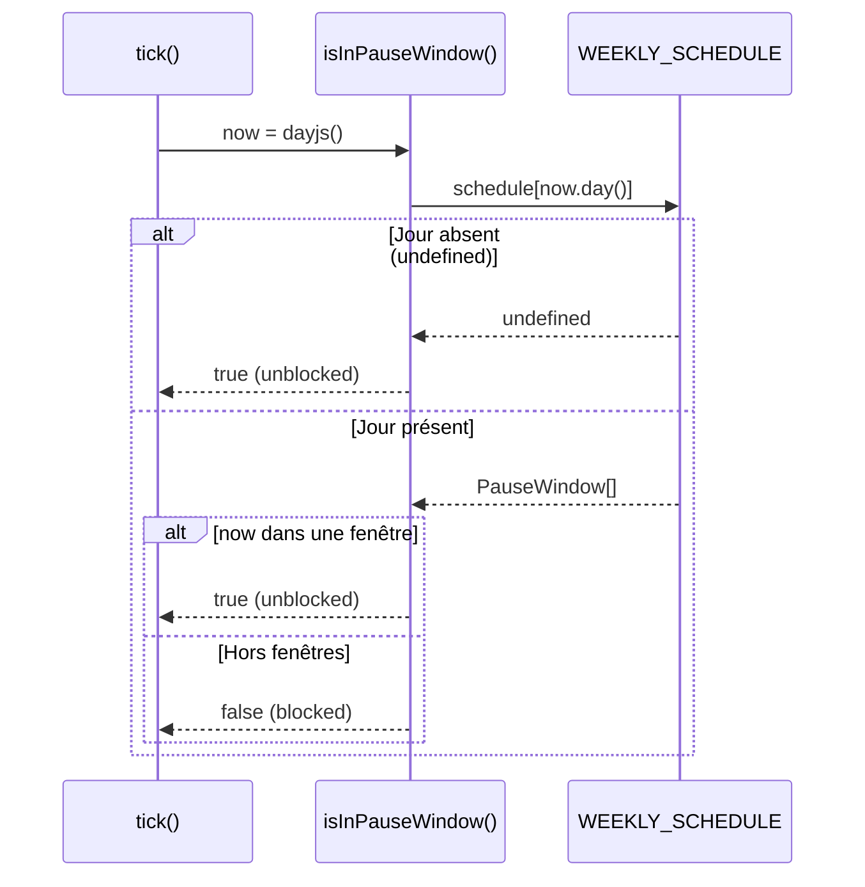

# Per-Day Pause Schedule — Technical Spec

## 1. Requirement Summary

- **Problem** : La configuration actuelle `ALLOWED_PAUSES` est un tableau unique de `PauseWindow[]` appliqué identiquement à tous les jours de la semaine. L'utilisateur ne peut pas définir des horaires de pause différents selon le jour (ex: pause déjeuner plus longue le mercredi, pas de pause le samedi).
- **Goals** :
  1. Permettre de définir des `PauseWindow[]` différentes pour chaque jour de la semaine
  2. Conserver la rétro-compatibilité avec `ACTIVE_DAYS` (fusionner les deux concepts)
  3. Un jour absent de la configuration = jour non actif (pas de blocage)
- **Scope** : `apps/server` uniquement (config + scheduleService).

## 2. Existing Code Analysis

### Fichiers impactés

| Fichier                                      | Rôle actuel                                            | Impact                               |
| -------------------------------------------- | ------------------------------------------------------ | ------------------------------------ |
| `src/config/focus.ts`                        | Définit `PauseWindow`, `ACTIVE_DAYS`, `ALLOWED_PAUSES` | Restructuration complète             |
| `src/services/scheduleService.ts`            | `isInPauseWindow()` + `isScheduledPause()`             | Adaptation signature + logique       |
| `test/unit/services/scheduleService.test.ts` | 5 tests pour `isInPauseWindow`                         | Mise à jour signature + nouveaux cas |

### Structure actuelle

```typescript
// config/focus.ts
export type PauseWindow = { start: string; end: string };
export const ACTIVE_DAYS: number[] = [0, 1, 2, 3, 4, 5, 6];
export const ALLOWED_PAUSES: PauseWindow[] = [
  { start: '12:00', end: '13:30' },
  { start: '18:00', end: '19:30' },
];
```

```typescript
// services/scheduleService.ts
export function isInPauseWindow(now: Dayjs, activeDays: number[], pauses: PauseWindow[]): boolean;
```

**Constat** : `ACTIVE_DAYS` et `ALLOWED_PAUSES` sont deux concepts séparés mais liés. En les fusionnant dans une structure par jour, on simplifie et on gagne en expressivité.

## 3. Technical Solution

### 3.1 Nouveau type `WeeklySchedule`

```typescript
// config/focus.ts

export type PauseWindow = { start: string; end: string }; // inchangé

/** Clés : 0=Dimanche, 1=Lundi, ..., 6=Samedi (convention dayjs). */
export type WeeklySchedule = Partial<Record<DayOfWeek, PauseWindow[]>>;

export type DayOfWeek = 0 | 1 | 2 | 3 | 4 | 5 | 6;
```

**Règle** : un jour absent du `Record` = jour non actif (unblocked). Un jour présent avec `[]` = actif sans pause (blocked toute la journée).

### 3.2 Nouvelle configuration

```typescript
// config/focus.ts

export const WEEKLY_SCHEDULE: WeeklySchedule = {
  0: [
    { start: '12:00', end: '13:30' },
    { start: '18:00', end: '19:30' },
  ], // Dimanche
  1: [
    { start: '12:00', end: '13:30' },
    { start: '18:00', end: '19:30' },
  ], // Lundi
  2: [
    { start: '12:00', end: '13:30' },
    { start: '18:00', end: '19:30' },
  ], // Mardi
  3: [
    { start: '12:00', end: '13:30' },
    { start: '18:00', end: '19:30' },
  ], // Mercredi
  4: [
    { start: '12:00', end: '13:30' },
    { start: '18:00', end: '19:30' },
  ], // Jeudi
  5: [
    { start: '12:00', end: '13:30' },
    { start: '18:00', end: '19:30' },
  ], // Vendredi
  6: [
    { start: '12:00', end: '13:30' },
    { start: '18:00', end: '19:30' },
  ], // Samedi
};
```

Cette valeur par défaut reproduit exactement le comportement actuel (`ACTIVE_DAYS = [0..6]`, mêmes pauses partout).

### 3.3 Suppression de `ACTIVE_DAYS` et `ALLOWED_PAUSES`

Les deux exports sont remplacés par `WEEKLY_SCHEDULE`. Le concept "jour actif" est implicite : un jour est actif s'il est présent comme clé dans `WEEKLY_SCHEDULE`.

### 3.4 Refactoring de `scheduleService.ts`

```typescript
import dayjs, { type Dayjs } from '../utils/dayjs';
import { WEEKLY_SCHEDULE, type WeeklySchedule, type DayOfWeek } from '../config/focus';

/**
 * Pure function: determines if `now` falls within a scheduled pause window.
 * Returns true when blocking should be paused (inactive day or inside a pause window).
 */
export function isInPauseWindow(now: Dayjs, schedule: WeeklySchedule): boolean {
  const dayPauses = schedule[now.day() as DayOfWeek];

  // Jour absent du schedule -> non actif -> unblocked
  if (dayPauses === undefined) {
    return true;
  }

  // Jour présent, vérifier les fenêtres de pause
  for (const pause of dayPauses) {
    const [startH, startM] = pause.start.split(':').map(Number);
    const [endH, endM] = pause.end.split(':').map(Number);

    const start = now.hour(startH).minute(startM).second(0);
    const end = now.hour(endH).minute(endM).second(0);

    if (now.isBetween(start, end, 'minute', '[)')) {
      return true;
    }
  }

  return false;
}

/** Wrapper using live clock and production config. */
export const isScheduledPause = (): boolean => {
  return isInPauseWindow(dayjs(), WEEKLY_SCHEDULE);
};
```

### 3.5 Diagramme de flux



## 4. Risks and Dependencies

| Risque                                               | Impact                                | Mitigation                                                            |
| ---------------------------------------------------- | ------------------------------------- | --------------------------------------------------------------------- |
| Breaking change interne                              | `isInPauseWindow` change de signature | Fonction pure, testée — mise à jour des tests en même temps           |
| Oubli d'un jour dans la config                       | Jour non bloqué par erreur            | Valeur par défaut avec les 7 jours. Commentaires explicites           |
| `ACTIVE_DAYS` / `ALLOWED_PAUSES` référencés ailleurs | Erreur de compilation                 | Grep complet — seuls 3 fichiers les utilisent (config, service, test) |
| Type `DayOfWeek` vs `number`                         | `now.day()` retourne `number`         | Cast explicite `as DayOfWeek` dans le service                         |

## 5. Work Breakdown

| #   | Tâche                                                            | Fichiers                                     | Effort |
| --- | ---------------------------------------------------------------- | -------------------------------------------- | ------ |
| 1   | Ajouter types `DayOfWeek` + `WeeklySchedule`                     | `src/config/focus.ts`                        | S      |
| 2   | Remplacer `ACTIVE_DAYS` + `ALLOWED_PAUSES` par `WEEKLY_SCHEDULE` | `src/config/focus.ts`                        | S      |
| 3   | Refactorer `isInPauseWindow()` : nouvelle signature              | `src/services/scheduleService.ts`            | S      |
| 4   | Mettre à jour `isScheduledPause()`                               | `src/services/scheduleService.ts`            | S      |
| 5   | Mettre à jour les tests existants + ajouter cas par jour         | `test/unit/services/scheduleService.test.ts` | M      |
| 6   | Mettre à jour `CLAUDE.md` (ref `WEEKLY_SCHEDULE`)                | `CLAUDE.md`                                  | S      |
| 7   | Vérifier build + tests                                           | -                                            | S      |

**Effort total** : ~20 min d'implémentation.

## 6. Testing Strategy

| Type  | Quoi                                      | Comment                                             |
| ----- | ----------------------------------------- | --------------------------------------------------- |
| Unit  | Jour absent du schedule → `true`          | `schedule = { 1: [...] }`, tester un mardi (2)      |
| Unit  | Jour présent, dans une pause → `true`     | Lundi 12:30, schedule lundi avec pause 12:00-13:30  |
| Unit  | Jour présent, hors pause → `false`        | Lundi 15:00, schedule lundi avec pause 12:00-13:30  |
| Unit  | Jour présent, tableau vide `[]` → `false` | Samedi actif sans pauses → bloqué toute la journée  |
| Unit  | Pauses différentes par jour               | Lundi pause midi, mercredi pas de pause midi        |
| Unit  | Boundaries `[)` conservées                | Exactement à start → true, exactement à end → false |
| Build | Compilation TypeScript                    | `pnpm build:server` — pas d'erreur de types         |

Les 5 tests existants seront adaptés à la nouvelle signature (passer un `WeeklySchedule` au lieu de `activeDays` + `pauses`).

## 7. Open Questions

| #   | Question                                                                     | Proposition                                                                                                |
| --- | ---------------------------------------------------------------------------- | ---------------------------------------------------------------------------------------------------------- |
| 1   | Externaliser `WEEKLY_SCHEDULE` dans un fichier JSON (comme `domains.json`) ? | Non pour l'instant — la config est petite et typée. À reconsidérer si une UI de configuration est ajoutée. |
| 2   | Exporter `ACTIVE_DAYS` comme alias dérivé pour compatibilité ?               | Non — aucun consommateur externe, changement interne uniquement.                                           |
| 3   | Ajouter un endpoint API pour modifier le schedule à chaud ?                  | Hors scope — le serveur relit la config au redémarrage.                                                    |
