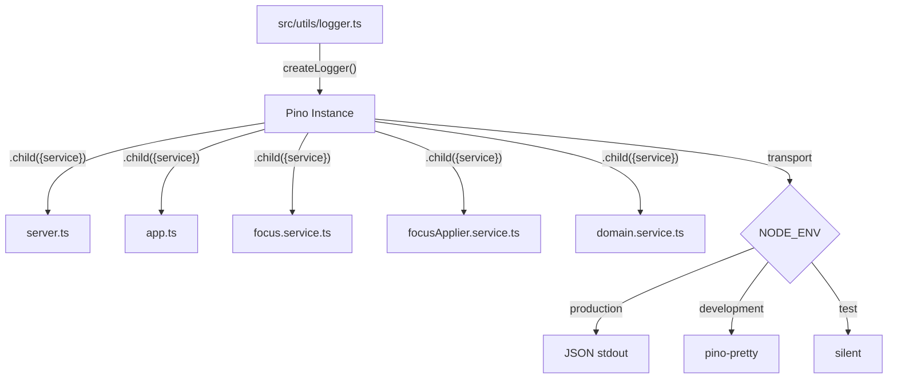

# Pino Logger — Technical Spec

## 1. Requirement Summary

- **Problem** : Le serveur utilise `console.*` avec un monkey-patch timestamps dans `utils/logger.ts`. Pas de logs structurés (JSON), pas de niveaux filtrables, pas de contexte par service.
- **Goals** :
  1. Remplacer tous les `console.log/warn/error` par un logger Pino structuré
  2. Supprimer le fichier `utils/logger.ts` (monkey-patch)
  3. Logs JSON en production, pretty-print en dev
  4. Child loggers par service pour le contexte
  5. Silent en test (pas de bruit dans `vitest`)
- **Scope** : `apps/server` uniquement. L'extension Chrome n'est pas concernée.

## 2. Existing Code Analysis

### Fichiers impactés

| Fichier                                | console.\*                            | Niveau      | Contexte         |
| -------------------------------------- | ------------------------------------- | ----------- | ---------------- |
| `src/server.ts`                        | `console.log` x1                      | info        | Startup          |
| `src/app.ts`                           | `console.warn` x1                     | warn        | CORS rejection   |
| `src/services/focus.service.ts`        | `console.log` x2, `console.error` x1  | info, error | Mode switching   |
| `src/services/focusApplier.service.ts` | `console.warn` x1, `console.error` x1 | warn, error | Script execution |
| `src/services/domain.service.ts`       | `console.error` x1                    | error       | Config loading   |
| `src/utils/logger.ts`                  | Monkey-patch global                   | -           | A supprimer      |

**Total** : 8 appels `console.*` + 1 fichier monkey-patch a supprimer.

### Composants réutilisables

- Aucune dépendance logging existante
- Le projet est CommonJS (`"module": "commonjs"` dans tsconfig)
- Express 5.2.1, compatible avec `pino-http`

## 3. Technical Solution

### 3.1 Architecture



### 3.2 Nouveau `utils/logger.ts`

```typescript
import pino from 'pino';

const isTest = process.env.NODE_ENV === 'test';
const isDev = process.env.NODE_ENV !== 'production' && !isTest;

export const logger = pino({
  level: isTest ? 'silent' : process.env.LOG_LEVEL || 'info',
  ...(isDev && {
    transport: {
      target: 'pino-pretty',
      options: { colorize: true, translateTime: 'SYS:HH:MM:ss' },
    },
  }),
});

export const createChildLogger = (service: string) => logger.child({ service });
```

**Choix** :

- `pino-pretty` en dev uniquement (via `transport`), JSON brut en prod
- `silent` en test pour ne pas polluer la sortie vitest
- `LOG_LEVEL` env var pour override dynamique
- Factory `createChildLogger()` pour contextualiser par service

### 3.3 Migration des appels

| Fichier                   | Avant                                                  | Apres                                                                    |
| ------------------------- | ------------------------------------------------------ | ------------------------------------------------------------------------ |
| `server.ts`               | `import './utils/logger'`                              | `import { createChildLogger } from './utils/logger'`                     |
| `server.ts`               | `console.log(\`FocusServer running...\`)`              | `log.info({ port }, 'FocusServer running')`                              |
| `app.ts`                  | `console.warn(\`CORS...\`)`                            | `log.warn({ origin }, 'CORS blocked')`                                   |
| `focus.service.ts`        | `console.log(\`Switching mode...\`)`                   | `log.info({ from: currentMode, to: targetMode }, 'Switching mode')`      |
| `focus.service.ts`        | `console.log(\`Mode set to...\`)`                      | `log.info({ mode: targetMode }, 'Mode applied')`                         |
| `focus.service.ts`        | `console.error(\`Error...\`)`                          | `log.error({ err: e }, 'Failed to apply mode')`                          |
| `focusApplier.service.ts` | `console.warn('[focus-apply] stderr:')`                | `log.warn({ stderr }, 'focus-apply stderr')`                             |
| `focusApplier.service.ts` | `console.error('[focus-apply] Script failed:', {...})` | `log.error({ err: e, exitCode, stderr, stdout }, 'focus-apply failed')`  |
| `domain.service.ts`       | `console.error(\`[domain.service]...\`)`               | `log.error({ err: error, configPath }, 'Failed to load domains config')` |

**Convention** : Pino structure `{ err, ...context }` pour les erreurs (serializer `err` built-in).

### 3.4 Dépendances

| Package       | Type          | Version | Raison           |
| ------------- | ------------- | ------- | ---------------- |
| `pino`        | production    | `^9.x`  | Logger principal |
| `pino-pretty` | devDependency | `^13.x` | Pretty-print dev |

Pas de `pino-http` pour l'instant : le serveur n'a que 2 routes GET simples, le logging HTTP ajouterait du bruit sans valeur. A reconsidérer si l'API grandit.

## 4. Risks and Dependencies

| Risque                       | Impact                           | Mitigation                                    |
| ---------------------------- | -------------------------------- | --------------------------------------------- |
| CommonJS compatibility       | Pino 9 supporte CJS nativement   | Vérifié : `require('pino')` fonctionne        |
| `pino-pretty` absent en prod | Crash si transport manquant      | Conditionnel `isDev` — pas chargé en prod     |
| Logs `launchd` daemon        | Le daemon redirige stdout/stderr | JSON stdout est compatible, pas de changement |
| Tests existants              | 14 tests unitaires passent       | Aucun ne mock `console.*` — pas d'impact      |

## 5. Work Breakdown

| #   | Tache                               | Fichiers                               | Effort |
| --- | ----------------------------------- | -------------------------------------- | ------ |
| 1   | Installer `pino` + `pino-pretty`    | `apps/server/package.json`             | S      |
| 2   | Réécrire `utils/logger.ts`          | `src/utils/logger.ts`                  | S      |
| 3   | Migrer `server.ts`                  | `src/server.ts`                        | S      |
| 4   | Migrer `app.ts`                     | `src/app.ts`                           | S      |
| 5   | Migrer `focus.service.ts`           | `src/services/focus.service.ts`        | S      |
| 6   | Migrer `focusApplier.service.ts`    | `src/services/focusApplier.service.ts` | S      |
| 7   | Migrer `domain.service.ts`          | `src/services/domain.service.ts`       | S      |
| 8   | Ajouter `NODE_ENV=test` dans vitest | `vitest.config.ts` ou `package.json`   | S      |
| 9   | Vérifier build + tests              | -                                      | S      |

**Effort total** : ~30 min d'implémentation. Toutes les taches sont S (small).

## 6. Testing Strategy

| Type   | Quoi                      | Comment                                                          |
| ------ | ------------------------- | ---------------------------------------------------------------- |
| Unit   | Logger silencieux en test | Vérifier `NODE_ENV=test` => `level: 'silent'`                    |
| Unit   | Tests existants passent   | `pnpm --filter @focus/server test` — aucun changement attendu    |
| Manual | Logs JSON en prod         | `NODE_ENV=production node dist/server.js` — vérifier JSON stdout |
| Manual | Pretty-print en dev       | `pnpm dev:server` — vérifier sortie colorisée                    |
| Build  | Compilation TypeScript    | `pnpm build:server` — pas d'erreur de types                      |

Les 14 tests unitaires existants ne sont pas impactés (ils testent des fonctions pures sans logging).

## 7. Open Questions

| #   | Question                                                | Proposition                                                                              |
| --- | ------------------------------------------------------- | ---------------------------------------------------------------------------------------- |
| 1   | Ajouter `pino-http` pour le logging des requetes HTTP ? | Non pour l'instant — 2 routes GET simples. A reconsidérer si l'API grandit.              |
| 2   | Log rotation / fichier ?                                | Non — le daemon `launchd` gère stdout/stderr. Utiliser `pino` > fichier si besoin futur. |
| 3   | Variable `LOG_LEVEL` dans `.env.example` ?              | Oui, documenter `LOG_LEVEL=info` comme valeur par défaut.                                |
